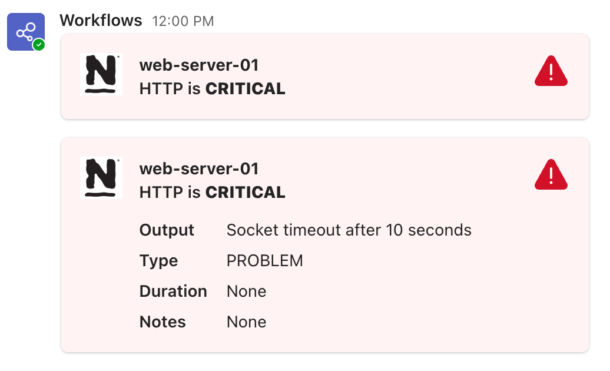

# Nagios Teams Notifications

A lightweight, zero-dependency Python script for sending Nagios/Icinga alerts to Microsoft Teams using Incoming Webhooks. This tool creates rich Adaptive Cards to display host and service status information.

## Features

* **Zero Dependencies:** Uses Python's standard library (`urllib`, `string.Template`), so no `pip install` is required.
* **Rich Notifications:** Sends formatted Adaptive Cards to Teams channels with status colors and icons.
* **Expandable Details:** Alerts are interactive—click on the card to expand it and view full output details.
* **Channel Management:** Supports mapping different logical channel names to specific Webhook URLs via a simple configuration file.

## Screenshots



## Setup & Configuration

### 1. Clone the repository

```bash
git clone https://github.com/zsoltf/nagios-teams.git
cd nagios-teams
```

### 2. Create Teams Workflow

You need to generate a webhook URL for your Teams channel:

1.  In Microsoft Teams, add a **Workflow** to your desired channel (search for "Post to a channel when a webhook request is received").
2.  **Important:** It is recommended to **copy the template workflow** and edit it. This allows you to modify the card payload and remove the extra message/text that Microsoft automatically adds to standard webhook notifications.
3.  Copy the generated Webhook URL.

### 3. Configure Webhooks

Create a file named `.teams.env` in the same directory as the script. This file maps your logical channel names to the actual Microsoft Teams Webhook URLs.

**Example `.teams.env`**:

```properties
# Format: CHANNEL_NAME=WEBHOOK_URL
OPS_TEAM=https://outlook.office.com/webhook/xxxx/IncomingWebhook/yyyy
DEV_TEAM=https://outlook.office.com/webhook/aaaa/IncomingWebhook/bbbb
```

## Usage

### Command Line Arguments

The script accepts two positional arguments (`alerttype` and `channel`) followed by optional flags for alert details.

**Syntax:**
```bash
python3 nagios-teams.py <alerttype> <channel> [options]
```

* **Positional Arguments:**
    * `alerttype`: The type of alert (`host` or `service`).
    * `channel`: The key defined in your `.teams.env` file (e.g., `OPS_TEAM`).

* **Optional Arguments:**
    * `--hostname`: The name of the host.
    * `--hoststate`: State of the host (UP, DOWN, UNREACHABLE).
    * `--notificationtype`: Type of notification (PROBLEM, RECOVERY, etc.).
    * `--hostoutput`: Output from the host check.
    * `--hostduration`: Duration of the event.
    * `--hostnotes`: Notes associated with the host.
    * `--hostalias`: Alias of the host.
    * `--servicedesc`: Description of the service.
    * `--servicestate`: State of the service (OK, WARNING, CRITICAL, UNKNOWN).
    * `--serviceoutput`: Output from the service check.
    * `--serviceduration`: Duration of the service event.
    * `--servicenotes`: Notes associated with the service.

### Manual Test Example

You can test the script manually to ensure your webhook is working:

```bash
python3 nagios-teams.py service OPS_TEAM \
    --hostname "web-server-01" \
    --servicedesc "HTTP" \
    --servicestate "CRITICAL" \
    --serviceoutput "Socket timeout after 10 seconds" \
    --notificationtype "PROBLEM"
```

## Nagios Configuration

Define the commands in your Nagios/Icinga configuration (e.g., `commands.cfg`).

We use `$ARG1$` to pass the channel name dynamically. This allows you to use the same command definition for different teams (e.g., Ops, Dev, DBAs).

### 1. Define the Commands

**Host Notification Command:**
```nagios
define command {
    command_name    notify-host-by-teams
    # $ARG1$ is the Channel Name (e.g., OPS_TEAM)
    command_line    /usr/bin/python3 /path/to/nagios-teams/nagios-teams.py host $ARG1$ --hostname "$HOSTNAME$" --hoststate "$HOSTSTATE$" --notificationtype "$NOTIFICATIONTYPE$" --hostoutput "$HOSTOUTPUT$" --hostduration "$HOSTDURATION$" --hostnotes "$HOSTNOTES$" --hostalias "$HOSTALIAS$"
}
```

**Service Notification Command:**
```nagios
define command {
    command_name    notify-service-by-teaus
    # $ARG1$ is the Channel Name (e.g., OPS_TEAM)
    command_line    /usr/bin/python3 /path/to/nagios-teams/nagios-teams.py service $ARG1$ --hostname "$HOSTNAME$" --servicedesc "$SERVICEDESC$" --servicestate "$SERVICESTATE$" --notificationtype "$NOTIFICATIONTYPE$" --serviceoutput "$SERVICEOUTPUT$" --serviceduration "$SERVICEDURATION$" --servicenotes "$SERVICENOTES$"
}
```

### 2. Configure Contacts

Add the commands to your contact definitions. Pass the **Channel Name** (as defined in your `.teams.env`) as the first argument using the `!` separator.

```nagios
define contact {
    contact_name                    ops-team
    use                             generic-contact
    alias                           Operations Team
    
    # Pass 'OPS_TEAM' as the channel argument
    service_notification_commands   notify-service-by-teams!OPS_TEAM
    host_notification_commands      notify-host-by-teams!OPS_TEAM
    
    email                           ops@example.com
}
```

## Customizing Templates

The message layout is defined using Python `string.Template` variables located at the top of the `nagios-teams.py` script:

* `host_template_string`
* `service_template_string`

You can edit these variables directly in the script to modify the Adaptive Card JSON structure or change the visible fields.

**Using the Designer:**
You can use the [official Adaptive Card Designer](https://adaptivecards.microsoft.com/designer) to visually build your card layout.

**Important:**
1. Copy the JSON output from the designer.
2. Paste it into the `content` dictionary within the `attachments` list in the Python script.
3. **Escape the `$` symbol:** You must change `$schema` to `$$schema` in your pasted JSON. This is required because Python's `string.Template` treats `$` as a variable placeholder.

## License

This project is licensed under the MIT License.
